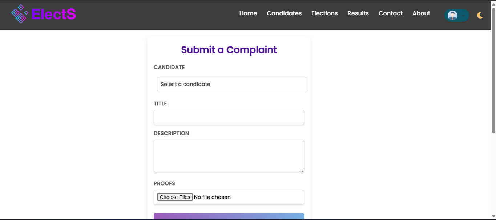
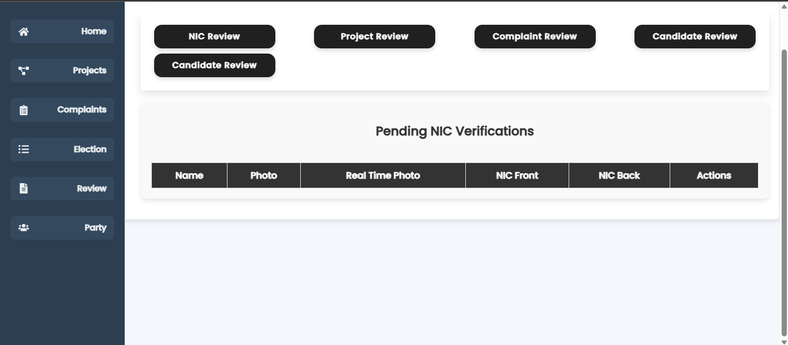
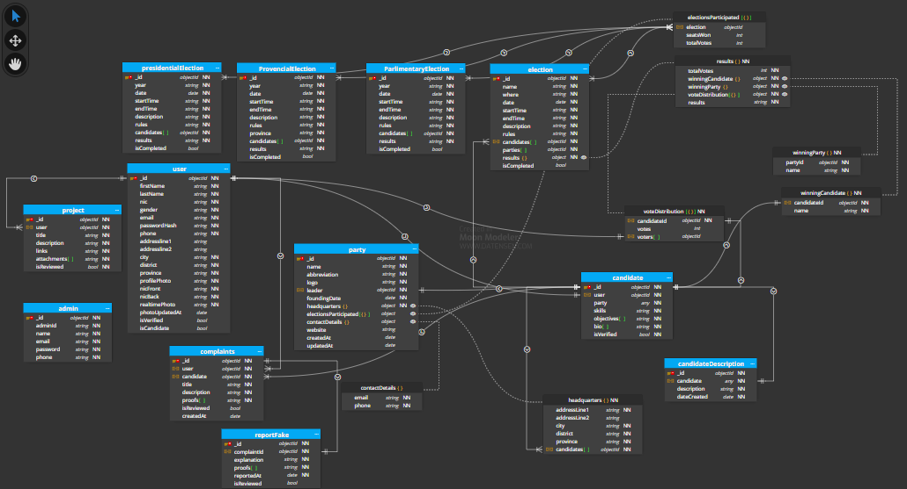
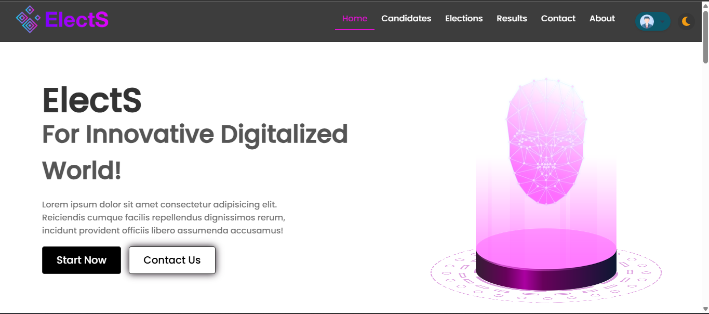
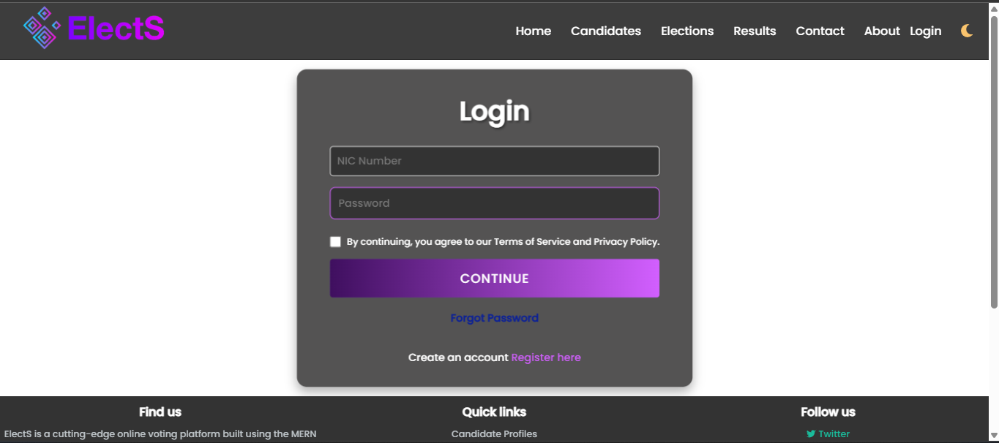
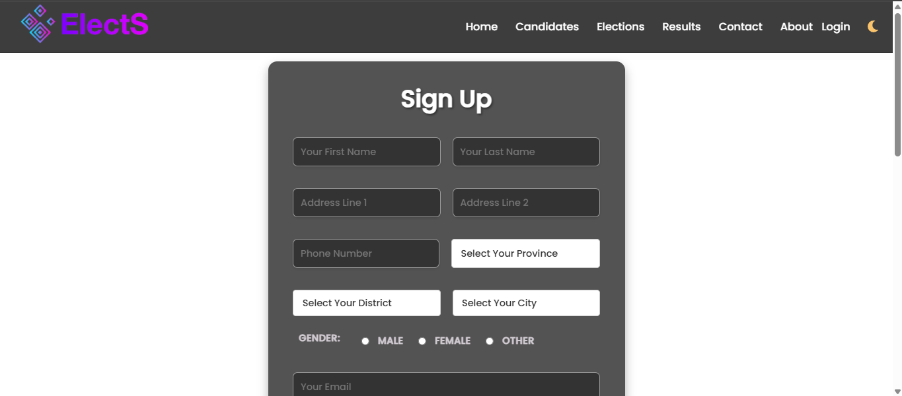
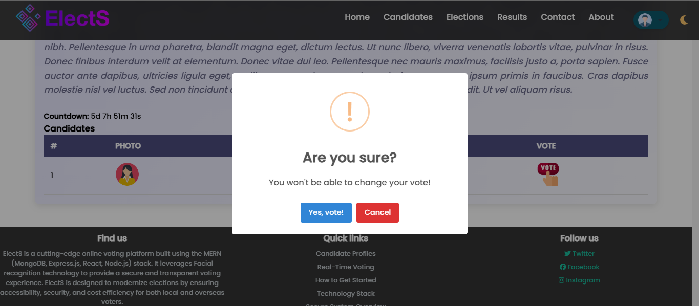
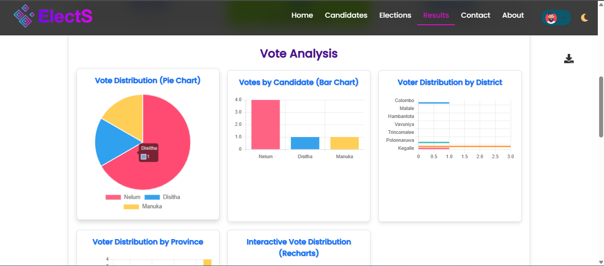
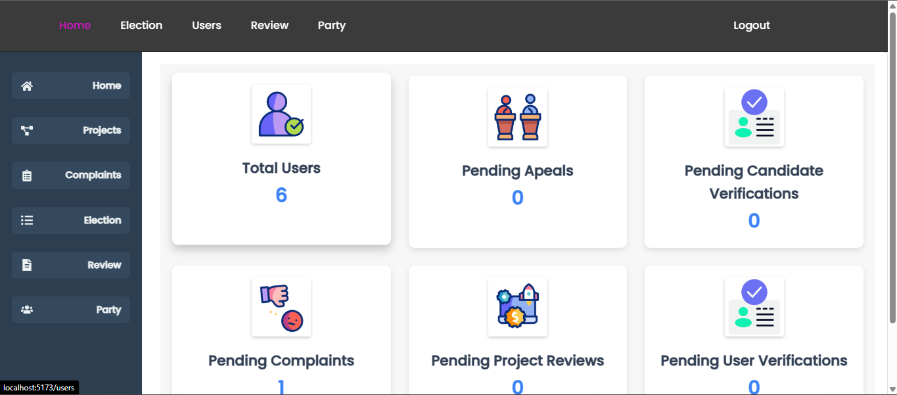

<a name="readme-top"></a>
<div align="center">
  <h1 align="center">ElectS - Advanced E-Voting System </h1>

  <p align="center">
    ElectS – Advanced E-Voting System is a cutting-edge online election platform built on the MERN stack, designed to ensure secure, transparent, and efficient voting. With facial recognition-based authentication, real-time election analytics, and seamless voter interaction, ElectS revolutionizes the way elections are conducted. Say goodbye to traditional inefficiencies—vote with confidence, anytime, anywhere! 🗳️🚀
  <br>
    <br />
  </p>
</div>

## 📌 Table of Contents  
🔹 [About ElectS](#about) – Learn what makes ElectS a game-changer.  
🔹 [Features](#features) – Explore the powerful capabilities of ElectS.  
🔹 [Installation](#installation) – Step-by-step setup instructions.  
🔹 [Usage](#usage) – How to use ElectS for seamless voting.  
🔹 [Tech Stack](#tech-stack) – The technologies powering ElectS.  
🔹 [Screenshots](#screenshots) – Visual previews of ElectS in action.  
🔹 [Contributing](#contributing) – Want to help improve ElectS? Start here!  
🔹 [License](#license) – Information about licensing.  
🔹 [Contact](#contact) – Get in touch with us!  
🔹 [Team Members](#team-members) – Meet the developers behind ElectS.  
🔹 [Final Note](#final-note) – A message from the team.  


## About

### 🗳️ What is ElectS?  
ElectS is an **advanced online voting system** built with the **MERN stack (MongoDB, Express.js, React, Node.js)** that aims to revolutionize the way elections are conducted. It introduces a **secure, transparent, and user-friendly digital election platform**, eliminating traditional challenges such as **fraud, high costs, manual inefficiencies, and accessibility barriers**.  

With **Advanced facial recognition**, ElectS ensures **voter identity verification**, preventing unauthorized access and multiple votes from the same user. This technology enhances security while maintaining a seamless voting experience for all users.  

### 🔴 Problems in Traditional Voting Systems
1. **Lack of Transparency** – Traditional elections often suffer from fraud, tampering, and lack of public trust.  
2. **High Costs** – Printing ballots, hiring officials, and setting up polling stations demand a significant budget.  
3. **Limited Accessibility** – Voters may struggle to reach polling stations due to distance, disabilities, or other constraints.  
4. **Manual Counting Errors** – Human errors in vote counting can lead to disputes and inaccuracies.  
5. **Security Risks** – Paper-based elections are vulnerable to tampering, while online systems may lack robust authentication.

### ✅ How ElectS Solves These Issues
✔️ **AI Facial Recognition:** Prevents voter fraud by verifying identities in real time.  
✔️ **End-to-End Encryption:** Ensures secure and tamper-proof voting.  
✔️ **Cost-Effective:** Eliminates the need for physical ballots and reduces election expenses.  
✔️ **Remote Voting:** Enables users to vote from anywhere, making elections more accessible.  
✔️ **Automated Vote Counting:** Delivers instant, accurate, and transparent results.  
✔️ **User-Friendly Interface:** Designed for all users, including those with minimal tech knowledge.  

ElectS redefines democracy by making elections **secure, efficient, and accessible** in the digital era. 🚀  
<p align="right">(<a href="#readme-top">back to top</a>)</p>


## Features  

ElectS is designed to **redefine digital elections** with security, transparency, and efficiency. Here’s what makes it powerful:  

### 🔍 **1. Facial Recognition for Secure Voting**  
🟢 Ensures **each voter is unique** by verifying identities using **real-time facial recognition**.  
🟢 Prevents **duplicate voting** and election fraud.  

### 👤 **2. Candidate Profiles with Past Projects & Future Plans**  
🟠 Provides **detailed candidate profiles**, including **previous achievements and future proposals**.  
🟠 Helps voters **make informed decisions** based on candidates' contributions and visions.  


### 📊 **3. Real-Time Election Monitoring & Analytics**  
🔵 Displays election progress **with live updates and graphical insights**.  
🔵 Provides **instant vote counting and data visualization** for transparency.  


### ⚖️ **4. Corruption Reporting Mechanism**  
🟣 Empowers voters to **report misconduct** by submitting **evidence-based complaints**.  
🟣 Enhances **electoral fairness** by holding candidates accountable.  


### 🆔 **5. Manual NIC Verification for Secure Registration**  
🟢 Requires users to **upload their National Identity Card (NIC) for admin verification**.  
🟢 Ensures that **only eligible voters can register**, preventing fake accounts.  


### 🏗 **6. Secure and Scalable System**  
🟠 Built on the **robust MERN stack**, ensuring **high performance and scalability** under heavy traffic.  
🟠 Implements **advanced encryption and secure storage** to protect voter data.  

### 💰 **7. Cost-Efficient Elections**  
🔵 Reduces election costs by eliminating **paper ballots, manual vote counting, and logistical expenses**.  
🔵 Makes **digital voting accessible and budget-friendly** for governments and organizations.  

### 🎨 **8. Light & Dark Mode for Better Accessibility**  
🌗 Supports both **Light Mode and Dark Mode**, allowing users to switch themes based on their preference.  
🌗 Enhances **user experience and accessibility**, reducing eye strain in low-light environments.  


ElectS is **built for the future of elections**—where security, fairness, and transparency come first! 🗳️✨  
<p align="right">(<a href="#readme-top">back to top</a>)</p>

---
 
## Installation  

ElectS is a **MERN-stack-based voting system**, and setting it up requires installing both the **frontend and backend** properly. Follow this step-by-step guide to get started.  

---

### ✅ **Prerequisites**  
Before installation, ensure you have the following installed on your system:  
🔹 **Node.js** (LTS version) – [Download & Install](https://nodejs.org/)  
🔹 **MongoDB** (Community Edition) – [Download & Install](https://www.mongodb.com/try/download/community)  
🔹 **Git** – [Download & Install](https://git-scm.com/)  
🔹 A **code editor** (Recommended: [VS Code](https://code.visualstudio.com/))  

---

## 🔹 **Step 1: Clone the Repository**  
Open your terminal or command prompt and run:  
```bash
git clone https://github.com/LayuruLK/ElectS---Advanced-E-Voting-System.git
```
Navigate to the project folder:  
```bash
cd ElectS---Advanced-E-Voting-System
```

---

## 🔹 **Step 2: Setup the Backend (Server)**
1️⃣ Move into the **backend** folder:  
   ```bash
   cd backend
   ```

2️⃣ Install all dependencies:  
   ```bash
   npm install
   ```

3️⃣ Create a **.env** file in the backend folder and add the following environment variables:  
   ```env
   PORT=5000
   MONGO_URI=your_mongodb_connection_string
   JWT_SECRET=your_jwt_secret_key
   ```
   ⚠️ **Replace** `your_mongodb_connection_string` with your actual MongoDB URL (if using MongoDB Atlas, get it from your database dashboard).  
   ⚠️ **Replace** `your_jwt_secret_key` with a strong, random string for authentication security.  

4️⃣ Start the backend server:  
   ```bash
   npm start
   ```
   If everything is correct, you should see:  
   ```bash
   Server running on port 5000
   Database connected successfully
   ```

---

## 🔹 **Step 3: Setup the Frontend (Client)**
1️⃣ Open a **new terminal** and navigate to the frontend folder:  
   ```bash
   cd ../frontend/my-app
   ```

2️⃣ Install frontend dependencies:  
   ```bash
   npm install
   ```

3️⃣ Start the frontend development server:  
   ```bash
   npm start
   ```

4️⃣ If everything is set up correctly, the React app should automatically open in your browser at:  
   ```
   http://localhost:3000
   ```

---

## 🔹 **Step 4: Connect Frontend & Backend**
By default, the frontend is configured to communicate with the backend running on `http://localhost:5000`.  
If needed, update the API base URL inside `frontend/src/config.js`:  
```js
export const API_BASE_URL = "http://localhost:5000";
```

---

## 🚀 **Final Step: Testing the Application**
Once both servers are running:  
🔹 Visit **http://localhost:3000** in your browser.  
🔹 Register a new user and test the voting process. ***(Note: We are currently using a sample NIC database for verification, so your NIC number may not be verified. This project is still under development. Once completed, we will expand our NIC database for full verification.)***
🔹 Open the **MongoDB database** to verify that users and votes are being stored correctly.  

---

## 🛠 **Troubleshooting**
❌ **Issue:** _Command not found: npm_  
✔️ **Solution:** Ensure **Node.js** is installed properly by running:  
   ```bash
   node -v
   npm -v
   ```  

❌ **Issue:** _MongoDB connection failed_  
✔️ **Solution:** Make sure MongoDB is **running** locally (`mongod`) or use **MongoDB Atlas** with the correct **connection string**.  

❌ **Issue:** _Backend server crashes_  
✔️ **Solution:** Check if all **environment variables** are correctly set in the `.env` file.  

---

## 🎯 **Next Steps**
Now that ElectS is up and running, you can:  
📌 Explore the **features** and test the application.  
📌 Modify the project to fit your needs.  
📌 Contribute to the development! See the [Contributing](#contributing) section.  

---

💡 **Need Help?**  
If you encounter any issues, feel free to open an **issue** in the GitHub repository or reach out via the [Contact](#contact) section. 🚀  

---

### 🔥 **Why This Version Stands Out:**  
✅ **Step-by-step guide with clear explanations** for beginners.  
✅ **Separate sections for backend and frontend setup** to avoid confusion.  
✅ **Code blocks for clarity** on commands and configurations.  
✅ **Common troubleshooting issues & solutions** included.  
✅ **Encourages next steps** after successful setup.  

This version ensures **even someone with no MERN experience** can easily install and run **ElectS**! 🚀 Let me know if you need any modifications. 😊
<p align="right">(<a href="#readme-top">back to top</a>)</p>

---

## Usage  

ElectS is a **secure online voting system** designed to ensure **transparent, efficient, and reliable elections**. Below is a step-by-step guide on how different users can interact with the system.  

## 🗳️ **For Voters**  
Voters can register, verify their identity, and cast their votes securely.  

### 🔹 **1. Register as a Voter**  
1️⃣ Click on the **Sign Up** button.  
2️⃣ Enter your **Full Name, Email, NIC Number, and Password**.  
3️⃣ Upload a **real-time photo** for facial recognition verification.  
4️⃣ Submit your details and wait for **admin approval**.  

📌 _(Note: NIC verification may fail as we are currently using a sample NIC database. The full system will support real NIC verification after development.)_  

---

### 🔹 **2. Log in and Verify Identity**  
1️⃣ Go to the **Login Page** and enter your **Email and Password**.  
2️⃣ The system will prompt you for **facial recognition verification**.  
3️⃣ Once verified, you will be redirected to the **Dashboard**.  

---

### 🔹 **3. Explore Elections & Cast Your Vote**  
1️⃣ Browse the list of **ongoing elections**.  
2️⃣ Click on an election to view **candidates' profiles, past projects, and future plans**.  
3️⃣ Click **Vote** for your chosen candidate.  
4️⃣ Confirm your vote (⚠️ **Votes cannot be changed once submitted!**).  

🎉 **Your vote is now recorded securely!**  

---

## 🎯 **For Candidates**  
Candidates can apply to run for elections, showcase their profile, and interact with voters.  

### 🔹 **1. Apply for an Election**  
1️⃣ Register as a **Candidate** following the same steps as voters.  
2️⃣ Once logged in, go to the **Apply for Election** section.  
3️⃣ Fill in the application form with:  
   - **Personal Details**  
   - **Election Details (Position, Party, etc.)**  
   - **Past Projects & Future Plans**  
4️⃣ Upload a **profile picture** and submit your application.  
5️⃣ Wait for **admin approval** before appearing in the elections list.  

---

## 🛠 **For Admins**  
Admins manage elections, approve candidates, verify voters, and oversee the voting process.  

### 🔹 **1. Log in as an Admin**  
1️⃣ Admins must log in using **admin credentials** provided by the system.  
2️⃣ Upon login, they will have access to the **Admin Dashboard**.  

---

### 🔹 **2. Manage Elections**  
✅ Create new elections and define **start & end times**.  
✅ View & approve **candidate applications**.  
✅ Verify voter **NIC details** and approve registrations.  
✅ Monitor **real-time voting analytics**.  

📊 **Admins can also access live election results with graphical insights!**  

---

## 🎨 **Theme Customization**  
ElectS supports **Light Mode & Dark Mode** for a personalized user experience.  
🔹 Click the **theme switch button** at the top-right corner to toggle between **Light** 🌞 and **Dark** 🌙 modes.  

---

## 🔥 **Key Notes**  
📌 **Once a vote is submitted, it cannot be changed.**  
📌 **A real-time photo is required for facial verification.**  
📌 **Candidates must receive admin approval before appearing on the election list.**  
📌 **Admins oversee voter and candidate verification.**  

---

## 🎯 **Next Steps**  
Now that you understand how to use ElectS, you can:  
📌 Start an **election** and test the voting system.  
📌 Explore **real-time results** and **analytics**.  
📌 Contribute to the project! See the [Contributing](#contributing) section.  

---

💡 **Need Help?**  
If you encounter any issues, feel free to open an **issue** in the GitHub repository or check the [Contact](#contact) section. 🚀  
<p align="right">(<a href="#readme-top">back to top</a>)</p>

---

## Tech Stack  

ElectS is built using the **MERN stack**, ensuring a seamless, secure, and scalable election system. Below is a breakdown of the technologies used:

---

### 🌐 **Frontend** (React.js)  
The user interface is developed using **React.js**, providing a smooth and dynamic experience.  

🔹 **React.js** – For building a responsive and interactive UI.  
🔹 **React Router** – For seamless navigation between pages.  
🔹 **Custom CSS** – For modern, responsive, and elegant styling.  
🔹 **Chart.js / Recharts** – For real-time election analytics and graphical data representation.  
🔹 **Light & Dark Mode Support** – Users can toggle between themes for better accessibility.  
🔹 **jspdf** – For downloading election results as a PDF.  
🔹 **react-icons** – For enhanced visualization and better UI elements.  
🔹 **react-webcam** – For capturing real-time images to proceed with facial recognition.  

---

### ⚙️ **Backend** (Node.js & Express.js)  
The backend is designed to handle authentication, voting operations, and data management.  
🔹 **Node.js** – Handles server-side logic.  
🔹 **Express.js** – For creating RESTful APIs.  
🔹 **JWT (JSON Web Token)** – For secure authentication and session management.  
🔹 **bcrypt.js** – For encrypting user passwords.  
🔹 **Multer** – For handling image uploads (e.g., profile pictures, NIC verification images).   

---

### 🗄️ **Database** (MongoDB)  
ElectS uses **MongoDB** to store user data, election details, votes, and reports.  
🔹 **MongoDB Atlas** – A cloud-based NoSQL database for scalable storage.  
🔹 **Mongoose** – An ODM (Object Data Modeling) library for MongoDB.  


---

### 🔍 **Facial Recognition**  
The system ensures secure voter verification through **real-time face matching**.  
🔹 **AWS Rekognition (aws-sdk)** – Used for facial recognition and identity verification.  
🔹 **Multer** – Handles image uploads for processing.   

---

### 🚀 **Authentication & Security**  
Security is a top priority in ElectS to prevent election fraud.  
🔹 **JWT (JSON Web Tokens)** – Secure token-based authentication.  
🔹 **bcrypt.js** – Encrypts passwords before storing them in the database.   

---

### 🖥️ **Admin Dashboard**  
A dedicated **Admin Panel** for managing elections, verifying users, and monitoring results.  
🔹 **React.js (Vite.js)** – Faster and optimized frontend.   

---

## 🔥 **Why This Tech Stack?**  
✅ **Scalability:** Handles large voter databases efficiently.  
✅ **Security:** Ensures encrypted data and secure voting.  
✅ **Performance**
<p align="right">(<a href="#readme-top">back to top</a>)</p>

---

## Screenshots  

Take a look at **ElectS** in action! Below are some screenshots showcasing the system's key features.  

### 🏠 **Home Page**  
The main landing page of ElectS, providing an intuitive and welcoming experience.  
  

### 🔐 **User Authentication**  
Secure **login and registration system** with facial recognition verification.  
  
  

### 🗳️ **Voting Interface**  
A clean and **user-friendly voting system** allowing voters to cast their votes seamlessly.  
  

### 📊 **Real-time Election Analytics**  
Graphical insights on elections with **live vote counting and analytics**.  
  

### 🔎 **Admin Dashboard**  
A powerful **Admin Panel** to manage elections, verify users, and oversee results.  
  
<p align="right">(<a href="#readme-top">back to top</a>)</p>

---

## Contributing  

We appreciate contributions from the open-source community! However, **ElectS** is still under active development.  

### 📌 **Current Contribution Policy**  
🚧 **Development Phase**: Until the project is completed, only **team members** can contribute to the codebase.  
✅ **Post-Completion**: Once the project is officially finished, we will welcome contributions from everyone!  

### 🔹 **How to Contribute (After Project Completion)?**  
1. **Fork the Repository** – Click the fork button at the top-right.  
2. **Clone the Repo** – Run:  
   ```sh
   git clone https://github.com/LayuruLK/ElectS---Advanced-E-Voting-System.git
   cd  ElectS---Advanced-E-Voting-System
   ```
3. **Create a New Branch** – Keep changes separate from the main branch.  
   ```sh
   git checkout -b feature-your-feature-name
   ```
4. **Make Your Changes** – Fix bugs, add features, or improve documentation.  
5. **Commit & Push** –  
   ```sh
   git commit -m "Added new feature"
   git push origin feature-your-feature-name
   ```
6. **Create a Pull Request** – Submit your changes for review.  

### ⚠️ **Contribution Guidelines**  
📌 Follow the coding standards used in the project.  
📌 Keep commits clear and concise.  
📌 Ensure changes do not break existing functionality.  
📌 Open an issue before starting major changes.  

📢 Stay tuned for an announcement once **ElectS** is ready for open contributions! 🚀  
<p align="right">(<a href="#readme-top">back to top</a>)</p>

---

## License  

This project is licensed under the **MIT License** – feel free to use, modify, and distribute it while ensuring attribution.  

🔗 **[Read the Full License](LICENSE)**  
<p align="right">(<a href="#readme-top">back to top</a>)</p>

---

## Contact  

💡 Have questions, feedback, or want to contribute? Feel free to reach out!  

📧 **Email:** [layurulakvidukarunathilaka@gmail.com](layurulakvidukarunathilaka@gmail.com)    
💼 **LinkedIn:** [Layuru Karunathilaka](https://www.linkedin.com/in/layuru-karunathilaka-02b345245/)  

🔹 **Project Repository:** [ElectS on GitHub](https://github.com/LayuruLK/ElectS---Advanced-E-Voting-System)  
<p align="right">(<a href="#readme-top">back to top</a>)</p>

---

## Team Members  

Meet the dedicated team behind **ElectS**:  

- **Layuru Karunathilaka**  
- **Pasindu Nuwan**  
- **Bingusala Kulathunga**  
- **M.S.F. Minha**  
- **Pabodha Wijesinghe**  
- **M.K.T. Bhasheery**  
- **Kasun Rajapaksha**  

🔹 **Want to contribute?** Check out the [Contributing Guidelines](#contributing)!  
<p align="right">(<a href="#readme-top">back to top</a>)</p>

---

## Final Note  

Thank you for exploring **ElectS**! 🚀 We are committed to making elections **transparent, secure, and accessible** for everyone.  

This project is still under development, and we are continuously working to improve it. Stay tuned for updates and enhancements!  

If you have any **questions, feedback, or suggestions**, feel free to reach out via the [Contact](#contact) section.  

⭐ **If you find this project useful, consider giving it a star on GitHub!** ⭐  

<p align="right">(<a href="#readme-top">back to top</a>)</p>
